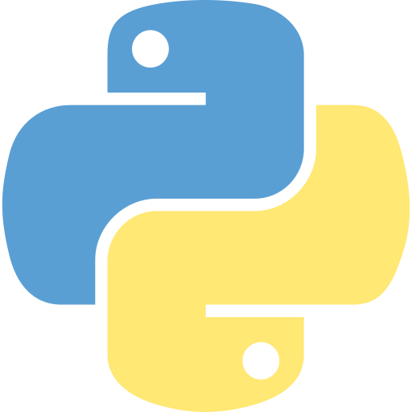

# My Portfolio!

### Description:
> I’m a frontend developer currently pursuing a degree in computer science, with a focus on creating clean, intuitive web experiences. As the founder of Skyzer Networks, a small web agency, I design and build websites with attention to both visual design and structured, maintainable architecture.

---

### Skills:

<table>
  <tr>
    <td align="center">
       
      HTML
    </td>
    <td align="center">
       
      CSS
    </td>
    <td align="center">
       
      JavaScript
    </td>
  </tr>
  <tr>
    <td align="center">
       
      Java
    </td>
    <td align="center">
       
      Python
    </td>
    <td align="center">
       
      React
    </td>
  </tr>
</table>

---

### Projects:

> __[Project 1:](https://skyzernetworks.com)__ This project contains a description
>
> __[Project 1:](https://skyzernetworks.com)__ This project contains a description
>
> __[Project 1:](https://skyzernetworks.com)__ This project contains a description

---

### Site Info:

- **Version** - 0.2.0
- **Author** - Michael Yurachek